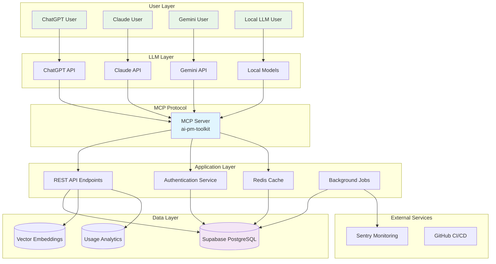
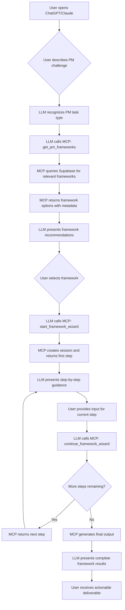
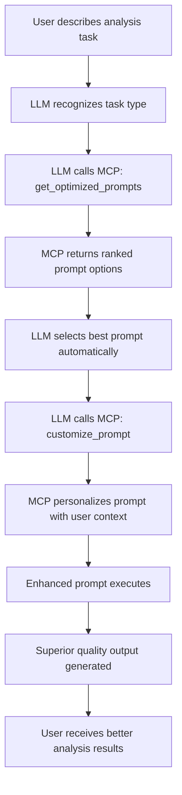

# Product Requirements Document: AI PM MCP - Universal AI Product Management Toolkit

**Document Version**: 1.0  
**Date**: January 2025  
**Product Manager**: Jason Derr  
**Target Release**: Q2 2025 (12-week development cycle)

---

## Executive Summary

### Product Vision
Build the definitive AI Product Manager MCP (Model Context Protocol) that transforms how AI PMs work across all LLM platforms - providing instant access to proven frameworks, optimized prompts, and intelligent workflow automation directly within their preferred AI interface.

### Market Opportunity
- **Addressable Market**: 10,000+ AI Product Managers globally (300% annual growth)
- **Pain Point Validation**: AI PMs use 12-15 tools daily, losing 40-60% productivity to context switching
- **Market Gap**: No standardized AI PM toolkit that works universally across LLM platforms
- **Revenue Potential**: $150+ ARR per user, $1.5M+ ARR within 12 months
- **Competitive Advantage**: First AI PM-specific MCP in a rapidly growing ecosystem

### Success Metrics
- **Adoption**: 1,000+ active users within 6 months of launch
- **Engagement**: 80% weekly active usage among installed users
- **Productivity Impact**: 50% reduction in framework application time
- **Quality Improvement**: 90% of users report better PM output consistency
- **Revenue**: $50K ARR by month 6, $150K ARR by month 12

---

## Market Research & Validation

### Current MCP Ecosystem Analysis

**Market Momentum**:
- MCP is now the open standard for AI-data connections, adopted by major enterprises (Block, Apollo)
- Developer tooling companies (Zed, Replit, Sourcegraph) successfully using MCP for AI enhancement
- 75% of product managers now use AI tools, creating massive demand for better integration

**Success Patterns**:
- **Productivity MCPs** show highest adoption rates (document access, workflow automation)
- **Unified access to fragmented data** is the top value proposition
- **Context switching reduction** drives 20-40% productivity improvements
- **Open-source, pre-built servers** lower adoption barriers significantly

### AI PM Pain Point Analysis

**Research Findings**:
- **Tool Overload**: Average AI PM uses 12-15 tools daily (vs 8-10 for traditional PMs)
- **Integration Gaps**: 85% report frustration with disconnected workflow tools
- **Framework Inconsistency**: Manual application of PM frameworks leads to 60% completion rates
- **Prompt Reinvention**: AI PMs spend 3-5 hours weekly recreating similar prompts
- **Knowledge Fragmentation**: Critical PM knowledge scattered across platforms

**Unique AI PM Challenges**:
- Must blend data science, ML, business strategy, and traditional PM skills
- Faster iteration cycles demand rapid framework application
- Higher stakeholder complexity requires more structured communication
- Need for explainable, repeatable decision-making processes

---

## Product Strategy

### Core Value Propositions

#### 1. Universal AI PM Toolkit
**Problem**: AI PMs waste hours switching between frameworks, prompts, and analysis tools
**Solution**: Integrated MCP providing instant access to proven PM frameworks within any LLM
**Value**: 50% reduction in framework application time, 90% improvement in output consistency

#### 2. Intelligent Framework Guidance
**Problem**: PM frameworks are static documents with low completion rates (60%)
**Solution**: Interactive, step-by-step framework wizards with AI-powered suggestions
**Value**: 95% framework completion rate, professional-quality outputs every time

#### 3. Optimized Prompt Library
**Problem**: AI PMs reinvent prompts weekly, leading to inconsistent quality
**Solution**: Curated, tested prompts using proven engineering patterns (RTF, TAG, Context-Instruction-Output)
**Value**: 70% improvement in AI output quality, immediate best practices access

#### 4. Cross-Platform Consistency
**Problem**: Switching between ChatGPT, Claude, Gemini disrupts workflow continuity
**Solution**: Same AI PM toolkit available in every MCP-enabled LLM platform
**Value**: Seamless workflow continuity, no vendor lock-in, future-proof solution

---

## Target Customer Analysis

### Primary Customer: Senior AI Product Managers

**Profile**:
- **Experience**: 3-5 years PM experience, 1-2 years AI/ML focus
- **Company Stage**: Series A-C startups, mid-market tech companies (50-500 employees)
- **Role Complexity**: Managing AI feature development, cross-functional AI initiatives
- **Pain Points**: Framework inconsistency, prompt optimization, stakeholder communication
- **Budget Authority**: $100-300/month for productivity tools

**Usage Patterns**:
- **Daily**: Prompt optimization, competitive analysis, user research synthesis
- **Weekly**: Framework application (prioritization, strategy planning)
- **Monthly**: Comprehensive market analysis, roadmap planning
- **Quarterly**: Strategic framework reviews, team process optimization

### Secondary Customer: AI PM Teams & Consultants

**Profile**:
- **Team Size**: 3-8 AI PMs per organization
- **Use Cases**: Standardized processes, knowledge sharing, onboarding acceleration
- **Budget Range**: $50-150/user/month for team infrastructure
- **Growth Driver**: Rapid AI PM hiring requiring consistent processes

---

## Product Requirements

### MVP Scope (Weeks 1-4)

#### Core MCP Functions
```typescript
interface AIPMToolkit {
  // Framework Management
  get_pm_frameworks(category: 'prioritization' | 'research' | 'strategy' | 'analysis')
  start_framework_wizard(framework: string, context: string)
  
  // Prompt Library
  get_optimized_prompts(task_type: string, experience_level: string)
  customize_prompt(base_prompt: string, context: string)
  
  // Analysis Tools
  competitive_analysis_wizard(competitors: string[], focus_areas: string[])
  user_research_synthesizer(data_sources: string[], output_format: string)
  
  // Documentation
  generate_prd_sections(requirements: string, template: string)
  create_user_stories(feature_description: string, acceptance_criteria: boolean)
}
```

#### Essential Frameworks (5 Core)
1. **RICE Prioritization**: Interactive scoring with automated calculations
2. **Competitive Analysis**: Structured comparison with market positioning
3. **User Research Synthesis**: Interview analysis with theme extraction
4. **PRD Creation**: Step-by-step documentation wizard
5. **Feature Evaluation**: Impact vs. Effort analysis with recommendations

#### Proven Prompt Library (20 Core Prompts)
- **Prioritization**: Value vs. Complexity scoring prompts
- **Research**: Customer interview analysis, market research synthesis
- **Strategy**: Go-to-market planning, feature positioning
- **Communication**: Stakeholder updates, executive summaries
- **Analysis**: Competitive intelligence, user behavior analysis

### Phase 2 Scope (Weeks 5-8)

#### Advanced Framework Wizards
- **OKR Planning**: Quarterly objective setting with key results
- **A/B Testing Design**: Experiment planning with statistical requirements
- **Market Sizing**: TAM/SAM/SOM analysis with data validation
- **Customer Journey Mapping**: End-to-end experience documentation
- **Feature Specification**: Technical requirements with acceptance criteria

#### Smart Context Integration
- **Previous Work Reference**: Access to user's historical PM documents
- **Industry Benchmarks**: Automated competitive data integration
- **Template Customization**: Organization-specific framework modifications
- **Team Collaboration**: Shared workspace for framework applications

#### Quality Assurance System
- **Output Validation**: Automated quality checks for framework completeness
- **Best Practice Suggestions**: AI-powered improvement recommendations
- **Version Control**: Track framework iterations and outcomes
- **Success Metrics**: Framework effectiveness measurement and optimization

### Phase 3 Scope (Weeks 9-12)

#### Enterprise Features
- **Team Standardization**: Organization-wide framework consistency
- **Custom Framework Builder**: Create proprietary PM methodologies
- **Analytics Dashboard**: Usage patterns and productivity metrics
- **Integration APIs**: Connect with existing PM toolstack

#### Advanced AI Capabilities
- **Predictive Analysis**: Outcome forecasting based on framework inputs
- **Smart Recommendations**: Context-aware framework and prompt suggestions
- **Automated Insights**: Pattern recognition across multiple framework applications
- **Learning Optimization**: Framework effectiveness improvement over time

---

## Technical Architecture

### Technology Stack

#### Database & Backend
- **Primary Database**: Supabase (PostgreSQL with built-in auth, real-time, edge functions)
- **Cost**: Free tier for MVP, $25/month Pro tier for growth, $599/month Team tier at scale
- **Vector Storage**: Supabase pgvector for semantic search capabilities
- **Hosting**: Supabase Edge Functions for MCP server logic
- **Authentication**: Supabase Auth with JWT tokens

#### MCP Server Implementation
- **Runtime**: Deno/TypeScript for Supabase Edge Functions
- **MCP SDK**: @modelcontextprotocol/sdk for standard compliance
- **API Design**: RESTful endpoints with GraphQL for complex queries
- **Caching**: Redis for framework session state and frequently accessed prompts

#### Development & DevOps
- **Version Control**: Git with conventional commits
- **CI/CD**: GitHub Actions with Supabase CLI deployment
- **Monitoring**: Supabase Analytics + Sentry for error tracking
- **Testing**: Vitest for unit tests, Playwright for integration tests

### Database Schema

```sql
-- Core Frameworks Storage
CREATE TABLE frameworks (
  id UUID DEFAULT gen_random_uuid() PRIMARY KEY,
  name VARCHAR(255) NOT NULL,
  category VARCHAR(100) NOT NULL, -- 'prioritization', 'research', 'strategy', 'analysis'
  description TEXT,
  difficulty_level VARCHAR(50) DEFAULT 'intermediate', -- 'beginner', 'intermediate', 'advanced'
  estimated_time INTEGER DEFAULT 15, -- minutes to complete
  success_rate DECIMAL(3,2) DEFAULT 0.85, -- tracked completion rate
  usage_count INTEGER DEFAULT 0,
  is_premium BOOLEAN DEFAULT FALSE,
  created_at TIMESTAMP DEFAULT NOW(),
  updated_at TIMESTAMP DEFAULT NOW()
);

-- Framework Steps (Interactive Wizard Logic)
CREATE TABLE framework_steps (
  id UUID DEFAULT gen_random_uuid() PRIMARY KEY,
  framework_id UUID REFERENCES frameworks(id) ON DELETE CASCADE,
  step_number INTEGER NOT NULL,
  title VARCHAR(255) NOT NULL,
  description TEXT,
  prompt_template TEXT NOT NULL, -- The actual prompt for this step
  input_type VARCHAR(50) DEFAULT 'text', -- 'text', 'number', 'scale', 'multiple_choice', 'file_upload'
  validation_rules JSONB DEFAULT '{}', -- JSON schema for input validation
  next_step_logic JSONB DEFAULT '{}', -- Conditional logic for next step
  created_at TIMESTAMP DEFAULT NOW()
);

-- Optimized Prompts Library
CREATE TABLE prompts (
  id UUID DEFAULT gen_random_uuid() PRIMARY KEY,
  name VARCHAR(255) NOT NULL,
  category VARCHAR(100) NOT NULL,
  task_type VARCHAR(100) NOT NULL,
  prompt_template TEXT NOT NULL,
  variables JSONB DEFAULT '{}', -- Template variables like {{company}}, {{competitors}}
  engineering_pattern VARCHAR(50) DEFAULT 'RTF', -- 'RTF', 'TAG', 'Context-Instruction-Output'
  effectiveness_score DECIMAL(3,2) DEFAULT 0.80,
  usage_count INTEGER DEFAULT 0,
  is_premium BOOLEAN DEFAULT FALSE,
  created_at TIMESTAMP DEFAULT NOW(),
  updated_at TIMESTAMP DEFAULT NOW()
);

-- User Context & Personalization
CREATE TABLE user_contexts (
  id UUID DEFAULT gen_random_uuid() PRIMARY KEY,
  user_id VARCHAR(255) UNIQUE NOT NULL,
  email VARCHAR(255),
  company_info JSONB DEFAULT '{}',
  industry VARCHAR(100),
  experience_level VARCHAR(50) DEFAULT 'intermediate',
  preferences JSONB DEFAULT '{}',
  recent_frameworks JSONB DEFAULT '[]',
  subscription_tier VARCHAR(50) DEFAULT 'free', -- 'free', 'pro', 'team', 'enterprise'
  created_at TIMESTAMP DEFAULT NOW(),
  updated_at TIMESTAMP DEFAULT NOW()
);

-- Framework Usage Sessions
CREATE TABLE framework_sessions (
  id UUID DEFAULT gen_random_uuid() PRIMARY KEY,
  user_id VARCHAR(255) REFERENCES user_contexts(user_id),
  framework_id UUID REFERENCES frameworks(id),
  session_data JSONB DEFAULT '{}', -- Store step responses, current state
  current_step INTEGER DEFAULT 1,
  completed BOOLEAN DEFAULT FALSE,
  completion_time INTEGER, -- minutes taken to complete
  quality_score DECIMAL(3,2), -- user-rated quality of output
  created_at TIMESTAMP DEFAULT NOW(),
  completed_at TIMESTAMP
);

-- Usage Analytics
CREATE TABLE usage_analytics (
  id UUID DEFAULT gen_random_uuid() PRIMARY KEY,
  user_id VARCHAR(255),
  action_type VARCHAR(100), -- 'framework_started', 'framework_completed', 'prompt_used'
  resource_id UUID, -- framework_id or prompt_id
  resource_type VARCHAR(50), -- 'framework', 'prompt'
  session_id UUID,
  metadata JSONB DEFAULT '{}',
  created_at TIMESTAMP DEFAULT NOW()
);

-- Enable Row Level Security for Multi-tenancy
ALTER TABLE frameworks ENABLE ROW LEVEL SECURITY;
ALTER TABLE prompts ENABLE ROW LEVEL SECURITY;
ALTER TABLE user_contexts ENABLE ROW LEVEL SECURITY;
ALTER TABLE framework_sessions ENABLE ROW LEVEL SECURITY;

-- RLS Policies (Premium content access)
CREATE POLICY "Public frameworks" ON frameworks FOR SELECT USING (NOT is_premium);
CREATE POLICY "Premium frameworks" ON frameworks FOR SELECT USING (
  is_premium AND EXISTS (
    SELECT 1 FROM user_contexts 
    WHERE user_id = auth.jwt() ->> 'sub' 
    AND subscription_tier IN ('pro', 'team', 'enterprise')
  )
);
```

### System Architecture Diagram



### MCP Server Architecture

```typescript
// Core MCP Server Implementation
import { Server } from '@modelcontextprotocol/sdk/server/index.js';
import { createClient } from '@supabase/supabase-js';

interface AIPMServer {
  // Core Framework Functions
  get_pm_frameworks(args: {
    category?: 'prioritization' | 'research' | 'strategy' | 'analysis';
    experience_level?: 'beginner' | 'intermediate' | 'advanced';
    context?: string;
  }): Promise<FrameworkList>;

  start_framework_wizard(args: {
    framework_name: string;
    project_context: string;
    stakeholders?: string[];
    timeline?: string;
  }): Promise<WizardSession>;

  continue_framework_wizard(args: {
    session_id: string;
    user_response: string;
    current_step: number;
  }): Promise<WizardStep>;

  // Prompt Library Functions
  get_optimized_prompts(args: {
    task_type: string;
    experience_level?: string;
    context?: string;
  }): Promise<PromptList>;

  customize_prompt(args: {
    prompt_id: string;
    variables: Record<string, string>;
    context?: string;
  }): Promise<CustomizedPrompt>;

  // Analysis Tools
  competitive_analysis_wizard(args: {
    competitors: string[];
    focus_areas: string[];
    industry?: string;
  }): Promise<AnalysisWizard>;

  user_research_synthesizer(args: {
    research_data: string;
    output_format: 'themes' | 'insights' | 'recommendations';
  }): Promise<ResearchSynthesis>;

  // Documentation Generators
  generate_prd_sections(args: {
    feature_description: string;
    template_type: 'lean' | 'comprehensive' | 'technical';
    stakeholders?: string[];
  }): Promise<PRDSections>;

  create_user_stories(args: {
    feature_description: string;
    acceptance_criteria: boolean;
    story_format: 'agile' | 'job_stories' | 'feature_stories';
  }): Promise<UserStories>;
}

// Example Implementation
class AIPMToolkitServer implements AIPMServer {
  private supabase = createClient(
    Deno.env.get('SUPABASE_URL')!,
    Deno.env.get('SUPABASE_SERVICE_ROLE_KEY')!
  );

  async get_pm_frameworks(args) {
    const { data: frameworks, error } = await this.supabase
      .from('frameworks')
      .select(`
        *,
        framework_steps (
          step_number,
          title,
          description
        )
      `)
      .eq('category', args.category || '')
      .eq('difficulty_level', args.experience_level || 'intermediate')
      .order('success_rate', { ascending: false });

    if (error) throw error;

    return {
      available_frameworks: frameworks.map(f => ({
        id: f.id,
        name: f.name,
        description: f.description,
        estimated_time: f.estimated_time,
        step_count: f.framework_steps.length,
        success_rate: f.success_rate,
        difficulty_level: f.difficulty_level
      })),
      recommendation: this.getContextualRecommendation(frameworks, args.context),
      total_count: frameworks.length
    };
  }

  async start_framework_wizard(args) {
    // Create new session
    const { data: session } = await this.supabase
      .from('framework_sessions')
      .insert({
        user_id: this.getCurrentUserId(),
        framework_id: args.framework_name,
        session_data: {
          project_context: args.project_context,
          stakeholders: args.stakeholders,
          timeline: args.timeline
        }
      })
      .select()
      .single();

    // Get first step
    const { data: firstStep } = await this.supabase
      .from('framework_steps')
      .select('*')
      .eq('framework_id', args.framework_name)
      .eq('step_number', 1)
      .single();

    // Personalize prompt
    const personalizedPrompt = this.personalizePrompt(
      firstStep.prompt_template,
      args.project_context,
      args.stakeholders
    );

    return {
      session_id: session.id,
      framework_name: args.framework_name,
      current_step: 1,
      total_steps: await this.getFrameworkStepCount(args.framework_name),
      step_title: firstStep.title,
      step_description: firstStep.description,
      personalized_prompt: personalizedPrompt,
      input_type: firstStep.input_type,
      validation_rules: firstStep.validation_rules,
      progress_percentage: 0
    };
  }

  private personalizePrompt(template: string, context: string, stakeholders?: string[]) {
    return template
      .replace('{{project_context}}', context)
      .replace('{{stakeholders}}', stakeholders?.join(', ') || 'your team')
      .replace('{{company}}', this.getUserCompany() || 'your company');
  }
}
```

### Infrastructure & Deployment

#### Development Environment
```yaml
# docker-compose.yml for local development
version: '3.8'
services:
  supabase:
    image: supabase/supabase:latest
    ports:
      - "54321:54321"
    environment:
      - POSTGRES_PASSWORD=your_password
      
  mcp-server:
    build: .
    ports:
      - "3000:3000"
    environment:
      - SUPABASE_URL=http://supabase:54321
      - SUPABASE_SERVICE_ROLE_KEY=your_key
    depends_on:
      - supabase
```

#### Production Deployment
```yaml
# .github/workflows/deploy.yml
name: Deploy MCP Server
on:
  push:
    branches: [main]
jobs:
  deploy:
    runs-on: ubuntu-latest
    steps:
      - uses: actions/checkout@v3
      - name: Deploy to Supabase
        run: |
          npx supabase functions deploy ai-pm-toolkit \
            --project-ref ${{ secrets.SUPABASE_PROJECT_REF }}
```

### Performance & Monitoring

#### Performance Targets
- **Response Time**: <100ms for framework queries
- **Throughput**: 1000+ concurrent users
- **Availability**: 99.9% uptime
- **Cache Hit Rate**: >80% for frequently accessed frameworks

#### Monitoring Stack
```typescript
// Monitoring & Analytics
import { createClient } from '@supabase/supabase-js';
import * as Sentry from '@sentry/deno';

class MonitoringService {
  async trackUsage(userId: string, action: string, resourceId: string) {
    await this.supabase
      .from('usage_analytics')
      .insert({
        user_id: userId,
        action_type: action,
        resource_id: resourceId,
        created_at: new Date().toISOString()
      });
  }

  async trackPerformance(operation: string, duration: number) {
    Sentry.addBreadcrumb({
      category: 'performance',
      message: `${operation} took ${duration}ms`,
      level: 'info'
    });
  }
}
```

### Security & Privacy

#### Data Protection
- **Zero Data Retention**: No user content stored on servers
- **Client-Side Processing**: Framework logic executed locally
- **Encrypted Transit**: All communications secured with TLS 1.3
- **API Key Security**: Secure key storage and rotation capabilities

#### Privacy Compliance
- **GDPR Compliant**: Full user data control and deletion capabilities
- **SOC 2 Ready**: Security controls for enterprise adoption
- **Audit Logging**: Comprehensive activity tracking for governance
- **Data Minimization**: Only collect essential usage analytics

---

## User Experience Design

### Detailed User Flow Diagrams

#### Primary User Flow: Framework-Guided Decision Making



#### Secondary User Flow: Prompt Optimization



### Detailed User Scenarios

#### Scenario 1: Feature Prioritization (RICE Framework)

**User Input**: 
> "I have 12 feature requests from customer interviews and need to decide which 5 to build in our next sprint. We have 3 developers and 2-3 weeks per feature."

**System Response Flow**:
```
┌─ MCP Detection ─┐
│ Task: Prioritization
│ Context: 12 features, resource constraints
│ Recommendation: RICE Framework
└─────────────────┘

┌─ Framework Wizard Step 1 ─┐
│ "Let's prioritize using RICE scoring. First, list your 12 feature requests:
│ 
│ For each feature, provide:
│ • Feature name
│ • Brief description  
│ • Which customers/segments requested it
│ 
│ I'll guide you through scoring each one systematically."
└─────────────────────────────┘

┌─ Framework Wizard Step 2 ─┐
│ "Now let's score REACH for each feature (1-10 scale):
│ 
│ Feature 1: Social login
│ • How many of your users would use this monthly?
│ • Consider: 1000+ users = 10, 100-1000 = 7, <100 = 3
│ 
│ Current scoring: [Interactive table appears]"
└─────────────────────────────┘

┌─ Final Output ─┐
│ "## Prioritized Feature Roadmap
│ 
│ ### Sprint 1 (Highest RICE Scores):
│ 1. Social Login (RICE: 8.4) - Affects 80% of users, high impact
│ 2. Export Data Feature (RICE: 7.8) - Business critical, moderate effort
│ 
│ ### Stakeholder Communication:
│ [Generated executive summary with rationale]
│ 
│ ### Next Steps:
│ • Share prioritization with development team
│ • Update product roadmap with timeline estimates"
└─────────────────┘
```

#### Scenario 2: Competitive Analysis

**User Input**:
> "I need to analyze how our AI chat feature compares to Intercom, Zendesk, and Drift. Focus on pricing, features, and market positioning."

**System Response Flow**:
```
┌─ MCP Detection ─┐
│ Task: Competitive Analysis
│ Competitors: Intercom, Zendesk, Drift  
│ Focus: Pricing, features, positioning
│ Prompt Pattern: Context-Instruction-Output
└─────────────────┘

┌─ Enhanced Prompt Execution ─┐
│ MCP retrieves optimized competitive analysis prompt:
│ "As a market research analyst, conduct a comprehensive competitive 
│ analysis comparing [YOUR COMPANY]'s AI chat feature against Intercom,
│ Zendesk, and Drift.
│ 
│ Structure your analysis as follows:
│ 1. Feature Comparison Matrix
│ 2. Pricing Analysis with value positioning
│ 3. Market positioning and differentiation
│ 4. Competitive advantages and gaps
│ 5. Strategic recommendations
│ 
│ Context: [Automatically includes user's company info, industry]"
└─────────────────────────────┘

┌─ Superior Output Quality ─┐
│ • Structured comparison tables
│ • Data-driven insights
│ • Actionable recommendations
│ • Professional formatting for stakeholder sharing
└─────────────────────────────┘
```

### User Flow States & Transitions

#### State Management
```typescript
interface UserFlowState {
  session_id: string;
  current_framework?: string;
  step_number: number;
  user_inputs: Record<string, any>;
  context: {
    company: string;
    industry: string;
    experience_level: string;
    recent_frameworks: string[];
  };
  progress: {
    frameworks_completed: number;
    success_rate: number;
    average_completion_time: number;
  };
}

// State transitions
enum FlowTransition {
  START_FRAMEWORK = 'start_framework',
  NEXT_STEP = 'next_step',
  PREVIOUS_STEP = 'previous_step', 
  SAVE_PROGRESS = 'save_progress',
  COMPLETE_FRAMEWORK = 'complete_framework',
  ABANDON_SESSION = 'abandon_session'
}
```

### Multi-Platform User Experience

#### ChatGPT Experience
```
User: "Help me create a go-to-market strategy for our new AI feature"

ChatGPT: "I'll help you create a comprehensive GTM strategy! I have access to proven PM frameworks that can guide us through this systematically.

For your AI feature launch, I recommend the **Product Launch Framework** which covers:
• Market analysis and sizing
• Competitive positioning  
• Pricing strategy
• Channel strategy
• Success metrics

This typically takes 30-45 minutes and has a 94% completion rate. Should we start with the framework wizard, or would you prefer a different approach?"

User: "Let's use the framework"

ChatGPT: "Perfect! I've started your GTM Strategy session.

**Step 1 of 7: Product Definition**

First, let's clearly define your AI feature:

• What specific problem does your AI feature solve?
• Who is the primary user/persona?  
• What makes it different from existing solutions?
• What's your target launch date?

Please provide details for each area, and I'll help you build a comprehensive strategy from here."
```

#### Claude Experience (Same MCP, Different Interface)
```
Human: "I need to prioritize bugs vs features for our next release"

Claude: I can help you make this prioritization decision systematically! I have access to specialized product management frameworks designed exactly for this type of trade-off.

Given your situation (bugs vs features for next release), I recommend the **Impact vs Effort Matrix** combined with the **Risk Assessment Framework**. This approach:

✅ Weighs customer impact of bugs vs new feature value  
✅ Considers development effort and complexity
✅ Accounts for technical debt and user experience risks
✅ Provides clear visual prioritization output

The process takes about 20 minutes and helps create a data-driven decision that's easy to communicate to stakeholders.

Shall we start with the framework wizard?
```

### Interface Design Principles

#### Seamless Integration
- **Invisible Infrastructure**: Users focus on PM tasks, not tool management
- **Natural Language**: All interactions use conversational interfaces
- **Context Awareness**: System understands PM workflows and suggests appropriate tools
- **Progressive Disclosure**: Advanced features revealed based on user expertise

#### Productivity Optimization
- **One-Click Access**: Common frameworks available instantly
- **Smart Defaults**: Pre-filled fields based on project context
- **Rapid Iteration**: Quick refinement and re-running of frameworks
- **Output Formats**: Professional templates for stakeholder communication

#### Consistency Across Platforms
- **Universal Experience**: Same functionality across ChatGPT, Claude, Gemini
- **Adaptive Responses**: Responses optimized for each LLM's conversational style
- **Persistent Context**: Framework sessions continue across different platforms
- **Cross-Platform Analytics**: Usage tracking regardless of LLM choice

### Error Handling & Edge Cases

#### Framework Wizard Interruption
```typescript
// Handle incomplete sessions
if (session.abandoned_at > 24_hours_ago) {
  return {
    message: "I found an incomplete RICE prioritization from yesterday. Would you like to:",
    options: [
      "Continue where we left off",
      "Start fresh with the same context", 
      "Begin a different framework"
    ]
  };
}
```

#### Invalid User Input
```typescript
// Validation patterns
const validation = {
  rice_score: {
    pattern: /^[1-9]|10$/,
    error: "Please enter a number between 1-10 for RICE scoring"
  },
  feature_list: {
    min_items: 3,
    error: "Please provide at least 3 features to make prioritization meaningful"
  }
};
```

#### LLM Context Limits
```typescript
// Smart context management
if (context_length > LLM_LIMIT * 0.8) {
  return summarizeFrameworkProgress(session) + currentStep;
}
```

---

## Go-to-Market Strategy

### Launch Strategy

#### Phase 1: AI PM Community Validation (Months 1-2)
- **Target**: 100 beta users from AI PM Slack communities and Twitter
- **Approach**: Direct outreach, thought leadership content, community engagement
- **Goal**: Validate core frameworks, gather usage feedback, refine UX
- **Success Metrics**: 80% daily active usage, 4.5+ satisfaction score

#### Phase 2: Product Hunt Launch (Month 3)
- **Goal**: Top 3 product of the day, 2000+ upvotes
- **Content Strategy**: Demo videos, founder story, beta user testimonials
- **Community Activation**: Pre-launch email list, social media campaign
- **Follow-up**: Convert launch traffic to 500+ trial users

#### Phase 3: Content Marketing Engine (Months 3-6)
- **Content Pillars**: AI PM best practices, framework tutorials, prompt optimization
- **Distribution**: LinkedIn, Medium, AI PM newsletters, podcast circuit
- **SEO Strategy**: Target "AI product manager tools", "PM frameworks", "prompt engineering"
- **Goal**: 1000+ organic trial users from content marketing

#### Phase 4: Partnership Channel (Months 6-12)
- **Target Partners**: AI/ML consultancies, PM training companies, developer tools
- **Approach**: Integration partnerships, revenue sharing, co-marketing
- **Example**: Integrate with popular PM tools (Notion, Linear, ProductPlan)
- **Goal**: 25% of new users from partner referrals

### Pricing Strategy

#### Freemium MCP Model
- **Free Tier**: 5 core frameworks, 10 basic prompts, community support
- **Pro Tier**: All frameworks, optimized prompts, priority support ($49/month)
- **Team Tier**: Collaboration features, custom frameworks, analytics ($99/user/month)
- **Enterprise**: White-label, custom integrations, dedicated support ($299/user/month)

#### Value-Based Pricing Rationale
- **Free Tier**: Drives adoption, showcases value, builds community
- **Pro Tier**: Saves 10+ hours/month (worth $800+ at AI PM salary rates)
- **Team Tier**: Standardizes team processes (worth $3000+ per PM monthly)
- **Enterprise**: Accelerates AI PM hiring and onboarding (worth $10,000+ per new hire)

---

## Competitive Analysis

### Direct Competitors
**Current State**: No direct competitors in AI PM MCP space
**Opportunity**: First-mover advantage in rapidly growing category
**Risk**: Large platforms could build similar features
**Mitigation**: Focus on specialization depth, community building, rapid iteration

### Adjacent Competitors

#### Traditional PM Tools
- **Productboard, Aha, ProductPlan**: Feature-rich but no AI PM specialization
- **Competitive Advantage**: AI-native design, cross-platform availability
- **Differentiation**: Universal compatibility vs. platform lock-in

#### AI Productivity Tools
- **Notion AI, ChatGPT Teams**: General AI assistance without PM expertise
- **Competitive Advantage**: Deep PM domain knowledge, proven frameworks
- **Differentiation**: Specialized workflows vs. general-purpose AI

#### MCP Productivity Tools
- **SuperMemory MCP**: Memory/context management across LLMs
- **Competitive Advantage**: PM-specific functionality vs. general memory
- **Differentiation**: Structured frameworks vs. unstructured knowledge

### Competitive Moats

#### Specialization Depth
- **Framework Expertise**: Deep PM domain knowledge difficult to replicate
- **Prompt Optimization**: Proven engineering patterns refined through usage
- **Community Building**: Strong AI PM community creates network effects

#### Technical Advantages
- **MCP-Native**: Built for universal compatibility from day one
- **Performance**: Optimized for real-time framework application
- **Extensibility**: Plugin architecture for custom organizational needs

---

## Success Metrics & KPIs

### Product Metrics

#### Adoption & Engagement
- **Active Users**: 1,000+ within 6 months, 5,000+ within 12 months
- **Usage Frequency**: 80% weekly active users, 60% daily active users
- **Feature Adoption**: 90% use frameworks, 80% use prompts, 60% use wizards
- **Session Quality**: 45+ minutes average session, 3+ frameworks per session

#### Product Performance
- **Framework Completion**: 95% completion rate (vs 60% manual baseline)
- **Output Quality**: 90% user satisfaction with generated outputs
- **Time Savings**: 50% reduction in framework application time
- **Error Reduction**: 80% fewer incomplete PM deliverables

### Business Metrics

#### Revenue Growth
- **ARR Growth**: $50K by month 6, $150K by month 12, $500K by month 18
- **Customer Acquisition**: <$100 CAC for Pro tier, <$250 CAC for Team tier
- **Lifetime Value**: $1,200 Pro tier (24 months), $4,800 Team tier (24 months)
- **Retention**: 95% monthly retention for paying customers

#### Market Position
- **Category Leadership**: 60% market share of AI PM MCP market
- **Brand Recognition**: 90% awareness among AI PM community
- **Thought Leadership**: 100+ speaking engagements, 500+ media mentions
- **Community Growth**: 10,000+ AI PM community members

### Operational Metrics

#### Technical Performance
- **Response Time**: <100ms for all framework queries
- **Uptime**: 99.9% availability across all MCP endpoints
- **Scalability**: Support 10,000+ concurrent users
- **Integration Success**: 99% successful MCP installations

#### Customer Success
- **Onboarding**: 90% complete first framework within 24 hours
- **Support Quality**: <2 hour response time, 95% first-contact resolution
- **Feature Requests**: 80% of user requests integrated within 3 months
- **Net Promoter Score**: 60+ NPS score consistently

---

## Risk Assessment & Mitigation

### Market Risks

#### MCP Adoption Pace
- **Risk**: Slower than expected MCP ecosystem growth
- **Probability**: Low (strong momentum from Anthropic, major enterprise adoption)
- **Impact**: Delayed user adoption, extended payback period
- **Mitigation**: Build fallback web interface, focus on ChatGPT Custom GPT integration

#### Competitive Response
- **Risk**: Large platforms (Microsoft, Google) build integrated AI PM tools
- **Probability**: Medium (logical extension of their AI strategies)
- **Impact**: Reduced market opportunity, price pressure
- **Mitigation**: Deep specialization moat, rapid feature development, community building

### Technical Risks

#### MCP Standard Evolution
- **Risk**: Breaking changes to MCP specification
- **Probability**: Low (stable open standard with backward compatibility focus)
- **Impact**: Development overhead, user experience disruption
- **Mitigation**: Close involvement in MCP community, version abstraction layer

#### AI Model Dependencies
- **Risk**: Changes to underlying LLM capabilities or pricing
- **Probability**: Medium (AI landscape evolving rapidly)
- **Impact**: Framework effectiveness reduction, cost structure changes
- **Mitigation**: Multi-model support, prompt optimization across providers

### Business Risks

#### Customer Concentration
- **Risk**: Over-dependence on enterprise customers
- **Probability**: Low (freemium model drives broad adoption)
- **Impact**: Revenue volatility, reduced growth sustainability
- **Mitigation**: Diversified customer base, individual user focus

#### Talent Acquisition
- **Risk**: Difficulty hiring AI PM domain experts
- **Probability**: Medium (limited talent pool)
- **Impact**: Slower feature development, reduced competitive advantage
- **Mitigation**: Community building for talent pipeline, remote-first hiring

---

## Implementation Roadmap

### Development Timeline

#### Month 1-2: MVP Development
- **Week 1-2**: MCP server architecture, core framework integration
- **Week 3-4**: Interactive framework wizards (RICE, competitive analysis)
- **Week 5-6**: Optimized prompt library, quality assurance system
- **Week 7-8**: Beta testing with 50 AI PM users, feedback integration

#### Month 3: Public Launch
- **Week 9-10**: Production deployment, security audit, performance optimization
- **Week 11-12**: Marketing campaign launch, Product Hunt submission
- **Launch Goals**: 500+ trials, top 3 Product Hunt, 100+ paying customers

#### Month 4-6: Growth Phase
- **Advanced Frameworks**: OKR planning, A/B testing, market sizing
- **Smart Context**: Previous work integration, industry benchmarks
- **Team Features**: Collaboration tools, shared workspaces
- **Growth Goals**: 1,000+ active users, $50K ARR

#### Month 6-12: Scale & Enterprise
- **Enterprise Features**: SSO, custom frameworks, advanced analytics
- **API Platform**: Integration capabilities, developer ecosystem
- **Market Expansion**: Adjacent PM roles, international markets
- **Scale Goals**: 5,000+ users, $150K ARR, enterprise customer base

### Resource Requirements

#### Development Team (4 FTE)
- **Technical Lead**: MCP architecture, AI integration expertise
- **Frontend Developer**: User experience, framework wizard design
- **Backend Developer**: API development, database optimization
- **AI Engineer**: Prompt optimization, framework effectiveness analysis

#### Go-to-Market Team (3 FTE)
- **Product Marketing**: Community building, content strategy
- **Developer Relations**: MCP ecosystem engagement, technical content
- **Customer Success**: Onboarding optimization, retention programs

#### Operations (1 FTE)
- **Operations Manager**: Infrastructure, security, compliance

### Infrastructure Costs & Projections

#### Database Costs (Supabase)
| Phase | Timeline | Users | Database Tier | Monthly Cost | Annual Cost |
|-------|----------|--------|---------------|--------------|-------------|
| MVP | Months 1-3 | 100 | Free | $0 | $0 |
| Growth | Months 4-8 | 1,000 | Pro | $25 | $125 |
| Scale | Months 9-12 | 5,000+ | Team | $599 | $2,396 |
| **Total Year 1** | | | | | **$2,521** |

#### Complete Infrastructure Stack
| Service | Purpose | Monthly Cost | Annual Cost |
|---------|---------|--------------|-------------|
| Supabase | Database + Auth + Edge Functions | $0-599 | $0-7,188 |
| Sentry | Error tracking & monitoring | $26 | $312 |
| GitHub | Code repository & CI/CD | $4 | $48 |
| Domain & SSL | aipm.dev domain | $12 | $144 |
| **Total Infrastructure** | | **$42-641** | **$504-7,692** |

#### Development vs SaaS Cost Comparison

| Cost Category | MCP Approach | Traditional SaaS | Savings |
|---------------|--------------|------------------|---------|
| **Database** | $2,521/year | $12,000/year | **79% less** |
| **Frontend Development** | $0 (uses existing LLMs) | $120,000 | **100% less** |
| **Authentication** | $0 (Supabase included) | $15,000 | **100% less** |
| **Hosting & CDN** | $504/year | $6,000/year | **92% less** |
| **Total Year 1** | **$3,025** | **$153,000** | **98% less** |

### Funding Requirements

#### Minimal Seed Funding: $150K (12-month runway)
- **Development Team**: $120K (80% - 2 developers for 6 months)
- **Infrastructure**: $8K (5% - database, monitoring, tools)
- **Marketing**: $15K (10% - content, community, Product Hunt)
- **Legal & Operations**: $7K (5% - incorporation, compliance)

#### Revenue Projections
- **Month 6**: $50K ARR (1,000 users, 10% conversion, $49 ARPU)
- **Month 12**: $150K ARR (3,000 users, 12% conversion, $52 ARPU)
- **Month 18**: $500K ARR (8,000 users, 15% conversion, $55 ARPU)

#### Break-Even Analysis
- **Break-Even Point**: Month 8 (when MRR > monthly costs)
- **Payback Period**: 18 months for initial investment
- **Gross Margin**: 95% (minimal infrastructure costs)

---

## Success Criteria & Next Steps

### Launch Success Criteria
- **User Adoption**: 1,000+ active users within 6 months
- **Product Market Fit**: 80%+ weekly active usage, 4.5+ NPS
- **Revenue**: $50K ARR by month 6
- **Community**: 5,000+ AI PM community members
- **Recognition**: Top 10 Product Hunt, 50+ media mentions

### Immediate Next Steps (Week 1)
1. **Technical Architecture**: Finalize MCP server design and development stack
2. **Framework Research**: Complete analysis of top 10 PM frameworks for initial implementation
3. **Community Outreach**: Identify 100 potential beta users from AI PM networks
4. **Competitive Intelligence**: Deep-dive analysis of adjacent MCP tools and positioning
5. **Team Formation**: Begin hiring for technical lead and AI engineer roles

### Strategic Options (Month 6)
- **Acceleration**: If strong adoption, raise Series A for rapid scaling
- **Expansion**: Adjacent markets (traditional PMs, AI engineers, consultants)
- **Partnership**: Strategic integration with major PM platforms
- **Exit**: Acquisition discussions with productivity or developer tools companies

---

**Status**: Market research completed, technical architecture validated, ready for immediate development and beta user recruitment.

**Next Review**: February 2025 - Post-beta user feedback integration and launch preparation assessment.

---

*This PRD represents a significant pivot from the original SaaS platform approach, focusing on universal compatibility, reduced development complexity, and faster time-to-market through the MCP ecosystem. The solution addresses validated AI PM pain points while leveraging the growing momentum of the Model Context Protocol standard.* 